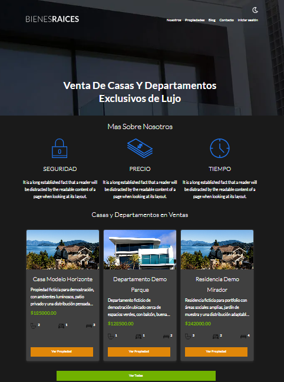
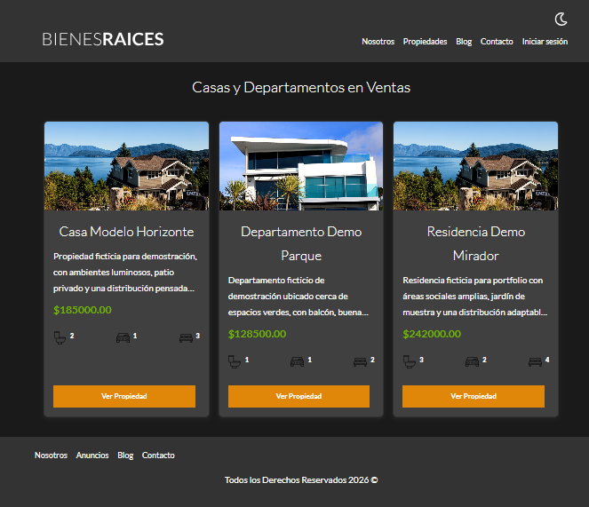
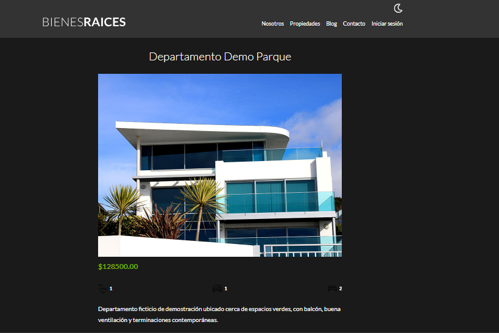
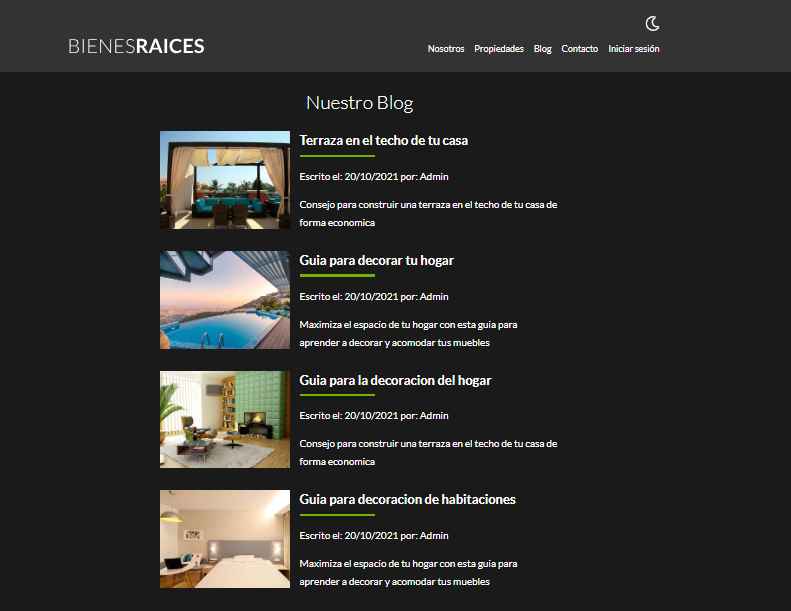
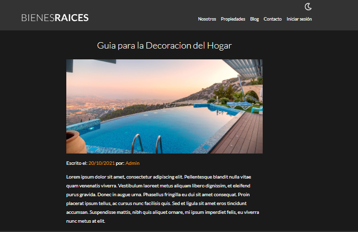
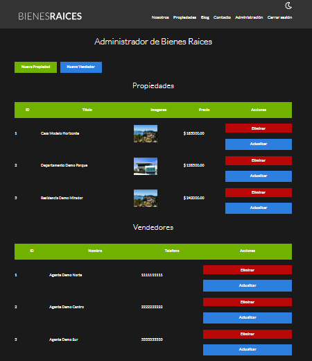
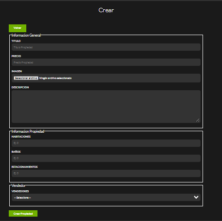

# 🏠 Bienes Raíces MVC — Portfolio

**Bienes Raíces MVC** es una aplicación web inmobiliaria full-stack desarrollada con PHP, MySQL, JavaScript y una arquitectura MVC propia. El proyecto simula el funcionamiento de una plataforma inmobiliaria, integrando una interfaz pública para la visualización de propiedades y un panel administrativo para la gestión de inmuebles y vendedores.

La aplicación está organizada en dos áreas principales: una sección pública, accesible para cualquier visitante, y un área administrativa protegida mediante autenticación.

### 🌐 Área pública

La página principal presenta el sitio mediante una portada visual y muestra automáticamente las tres primeras propiedades registradas en la base de datos. Cada inmueble se presenta mediante una tarjeta que incluye su imagen, título, descripción resumida, precio y características principales, junto con un enlace para consultar su información completa.

Desde la sección **Propiedades**, los visitantes pueden explorar el catálogo de inmuebles disponibles. Al seleccionar una propiedad, acceden a una página de detalle que muestra su fotografía, descripción completa, precio y características, como la cantidad de habitaciones, baños y espacios de estacionamiento. La información se obtiene de la base de datos MySQL y se presenta dinámicamente mediante PHP.

Además del catálogo inmobiliario, el sitio incorpora diferentes secciones informativas:

- **Nosotros:** presenta una sección institucional de ejemplo, con información ilustrativa sobre una inmobiliaria y su propuesta de servicios.
- **Blog:** permite explorar un listado de artículos de muestra relacionados con el sector inmobiliario. Cada artículo dispone de un enlace para acceder a su página individual y consultar el contenido completo.
- **Contacto:** incluye un formulario mediante el cual los visitantes pueden introducir sus datos, seleccionar un medio de contacto y enviar una consulta. El sistema incorpora validaciones del lado del servidor y una integración con PHPMailer para el envío de correos mediante SMTP, cuya entrega real requiere configurar un servicio de correo.

La interfaz también incorpora un diseño adaptable a diferentes tamaños de pantalla y un modo oscuro, permitiendo explorar el contenido desde dispositivos de escritorio o móviles.

### 🔐 Área administrativa

La aplicación dispone de un sistema de autenticación exclusivo para administradores. Una vez iniciada la sesión, el usuario autorizado puede acceder a un panel desde el cual se administran los registros de propiedades y vendedores almacenados en MySQL.

El panel permite realizar operaciones CRUD (crear, consultar, actualizar y eliminar) sobre ambas entidades.

**Gestión de propiedades:** el administrador puede registrar nuevos inmuebles introduciendo su título, precio, descripción, características y vendedor asociado. También puede cargar una imagen, que es validada y procesada por la aplicación antes de almacenarse. Las propiedades existentes pueden editarse o eliminarse desde el panel, y los cambios realizados se reflejan en el catálogo público.

**Gestión de vendedores:** permite registrar vendedores, consultar sus datos y modificar o eliminar los registros existentes. Cada propiedad se encuentra asociada a un vendedor mediante una relación en la base de datos. El sistema impide eliminar un vendedor que todavía tenga propiedades asociadas.

Las operaciones administrativas incorporan validaciones de datos, mensajes de confirmación y notificaciones sobre el resultado de las acciones realizadas. Además, el acceso a las rutas administrativas está restringido a usuarios con una sesión autenticada.

> **Nota:** Este proyecto fue desarrollado originalmente durante un curso de programación y posteriormente ampliado y personalizado como parte de mi aprendizaje. Su finalidad es demostrar conocimientos de desarrollo web. Los datos, propiedades, vendedores, testimonios y contenidos de apariencia comercial son ficticios o ilustrativos. La aplicación no representa una inmobiliaria real ni ofrece propiedades o servicios comerciales.

## Índice

- [Recorrido visual por la aplicación](#-recorrido-visual-por-la-aplicación)
- [Tecnologías utilizadas](#tecnologías-utilizadas)
- [Arquitectura MVC y estructura del proyecto](#arquitectura-mvc-y-estructura-del-proyecto)
- [Seguridad implementada](#seguridad-implementada)
- [Requisitos e instalación local](#requisitos-e-instalación-local)
- [Base de datos demo y acceso administrativo](#base-de-datos-demo-y-acceso-administrativo)
- [Limitaciones y consideraciones](#limitaciones-y-consideraciones)

## 📸 Recorrido visual por la aplicación

En esta sección se presenta el funcionamiento de las principales áreas de la inmobiliaria mediante capturas de pantalla. El recorrido muestra cómo los visitantes pueden explorar las propiedades y las secciones informativas, así como las herramientas disponibles para el administrador.

### 🏠 Página principal

La página principal funciona como punto de entrada a la aplicación. Su encabezado presenta la identidad visual del sitio y un menú de navegación que permite acceder a las secciones Nosotros, Propiedades, Blog y Contacto.

También incluye un enlace de inicio de sesión para acceder al área administrativa de demostración.

Debajo de la portada se muestran automáticamente las tres primeras propiedades recuperadas de la base de datos. Cada propiedad se presenta mediante una tarjeta que contiene su imagen, título, descripción resumida, precio y características principales, como la cantidad de habitaciones, baños y espacios de estacionamiento.

El botón **Ver propiedad** permite acceder a la página de detalle del inmueble seleccionado, mientras que el enlace **Ver Todas** dirige al catálogo completo de propiedades.



La parte inferior de la página incluye distintas secciones informativas y accesos adicionales.

El bloque de contacto dirige al formulario mediante el cual un visitante puede completar sus datos y realizar una consulta de demostración.

También se muestran artículos destacados del blog, acompañados de imágenes, títulos y enlaces que permiten acceder a sus respectivas entradas.

Finalmente, la portada incorpora un bloque testimonial de contenido ficticio, utilizado para mostrar cómo podría presentarse visualmente una sección de opiniones dentro de una página inmobiliaria.


### 🏘️ Catálogo de propiedades

La sección Propiedades permite consultar el listado de inmuebles registrados en la base de datos.

Cada propiedad se presenta mediante una tarjeta que reúne su fotografía, título, precio, una descripción resumida y sus características principales.

Las descripciones extensas se limitan visualmente para mantener una distribución uniforme de las tarjetas. Esto permite conservar la información completa en la base de datos sin afectar la presentación del catálogo.

Desde cada tarjeta, el visitante puede seleccionar **Ver propiedad** para abrir una página individual con información más detallada sobre el inmueble.

Las propiedades creadas, actualizadas o eliminadas desde el panel administrativo se reflejan en este catálogo.



### 🔎 Detalle de una propiedad

Al seleccionar un inmueble desde la página principal o el catálogo, el visitante accede a su página de detalle.

Esta sección presenta la fotografía de la propiedad junto con su título, precio, descripción completa y características, como habitaciones, baños y espacios de estacionamiento.

A diferencia de las tarjetas del catálogo, la descripción se muestra sin el límite de líneas utilizado en los listados, permitiendo consultar toda la información registrada.

Los datos se recuperan dinámicamente desde MySQL utilizando el identificador de la propiedad seleccionada.



### 📰 Blog

El sitio incluye una sección de blog que permite explorar distintos artículos de ejemplo relacionados con el sector inmobiliario.

Los artículos se presentan mediante una estructura visual que combina imágenes, títulos y enlaces de navegación. Esta sección sirve para mostrar cómo puede integrarse contenido informativo dentro de una aplicación web inmobiliaria.

Al seleccionar un artículo, el visitante accede a su página individual para consultar su contenido completo.



### 📖 Entrada individual del blog

La vista individual presenta el contenido de un artículo seleccionado desde el listado del blog.

Esta página utiliza una distribución específica para mostrar el encabezado, la imagen y el texto del artículo, diferenciándose de la presentación resumida utilizada en el listado general.

Los artículos forman parte del contenido ilustrativo de la aplicación y permiten demostrar la navegación entre páginas informativas.



### 🔐 Panel administrativo

La aplicación dispone de un panel administrativo accesible mediante autenticación.

Una vez iniciada la sesión, el administrador puede consultar las propiedades y los vendedores registrados en la base de datos y acceder a las herramientas necesarias para gestionarlos.

Desde este panel es posible:

- Registrar nuevas propiedades y vendedores.
- Consultar los registros existentes.
- Acceder a los formularios de edición.
- Eliminar registros mediante cuadros de confirmación.
- Consultar mensajes que informan el resultado de las operaciones realizadas.

El panel centraliza las operaciones CRUD de la aplicación y mantiene las herramientas de administración separadas de las páginas públicas.



### 📝 Creación y edición de propiedades

El formulario administrativo permite registrar nuevos inmuebles o modificar la información de las propiedades existentes.

El administrador puede introducir el título, precio, descripción y características del inmueble, seleccionar el vendedor asociado y cargar una fotografía.

Cuando se selecciona una imagen, la aplicación comprueba su validez y la procesa antes de almacenarla. Los archivos se guardan con nombres generados por el sistema.

Los formularios incorporan validaciones del lado del servidor para comprobar que la información introducida cumple los requisitos establecidos. Si se detectan errores, se muestran mensajes para que el administrador pueda corregir los campos correspondientes.

Una vez guardada correctamente la información, la propiedad queda registrada en la base de datos y puede visualizarse desde el catálogo público y su página de detalle.



## Tecnologías utilizadas

- **Back-end:** PHP con `mysqli` y arquitectura MVC propia.
- **Base de datos:** MySQL / MariaDB.
- **Front-end:** HTML, CSS, SCSS y JavaScript.
- **Gestión de dependencias PHP:** Composer.
- **Procesamiento de imágenes:** Intervention Image.
- **Correo:** PHPMailer.
- **Compilación de recursos:** Gulp, Sass, PostCSS, Autoprefixer, cssnano, Terser, Sharp y glob.

## Arquitectura MVC y estructura del proyecto

La aplicación separa las responsabilidades principales en controladores, modelos y vistas. El punto de entrada web es `public/index.php`; el router MVC resuelve las rutas de la aplicación y las dirige al controlador correspondiente.

```text
controllers/  Controladores de páginas, autenticación y administración
models/       Modelos y Active Record propio
mvc/          Router MVC
views/        Layouts, páginas y vistas administrativas
includes/     Configuración, funciones auxiliares y conexión
src/          Fuentes SCSS, JavaScript e imágenes
public/       Punto de entrada, recursos compilados e imágenes cargadas
database/     Esquema y datos de la base demo
screenshots/  Capturas utilizadas en este README
```

## Seguridad implementada

Las siguientes medidas reducen riesgos frecuentes, pero no constituyen una certificación de seguridad ni sustituyen una auditoría profesional para un entorno productivo.

| Riesgo abordado | Medida implementada |
| --- | --- |
| SQL Injection | Consultas con valores variables mediante sentencias preparadas de `mysqli`. |
| XSS | Codificación de salida HTML para datos dinámicos en textos y atributos. |
| CSRF | Tokens generados y almacenados en sesión, incluidos y verificados en los formularios POST. |
| Acceso no autorizado | Protección de rutas administrativas mediante comprobación de sesión autenticada. |
| Seguridad de sesiones | Regeneración del identificador tras el inicio de sesión y destrucción de la sesión al cerrar sesión. |
| Subida insegura de imágenes | Verificación de carga, tipo real, tamaño y dimensiones; procesamiento de imágenes y nombres aleatorios para el almacenamiento. |
| Enumeración de usuarios | Mensaje genérico de autenticación para correos inexistentes y contraseñas incorrectas. |

## Requisitos e instalación local

### Requisitos

- PHP 8.4 o una versión compatible con las dependencias del proyecto.
- Extensiones de PHP: `mysqli`, `gd` y `mbstring`.
- Composer.
- Node.js y npm.
- MySQL o MariaDB.

### Instalación de dependencias

Desde la raíz del proyecto, instalá las dependencias de PHP:

   ```bash
   composer install
   ```

Después, instalá las dependencias de front-end:

   ```bash
   npm install
   ```

### Configuración de `.env`

Creá la configuración local a partir del archivo de ejemplo:

   ```bash
   cp .env.example .env
   ```

   En Windows PowerShell podés usar:

   ```powershell
   Copy-Item .env.example .env
   ```

Editá `.env` con los datos de tu entorno local. La base demo utiliza el nombre `bienesraices_demo`. Las variables SMTP deben configurarse solo si querés probar el envío de correo.

### Importación de la base demo

Importá la base de datos demo:

   ```bash
   mysql -u TU_USUARIO -p < database/inmobiliaria_demo.sql
   ```

### Compilación de recursos

Compilá CSS, JavaScript e imágenes:

   ```bash
   npm run build
   ```

### Inicio del servidor

Iniciá el servidor local desde la raíz del proyecto:

   ```bash
   php -S 127.0.0.1:8000 -t public router.php
   ```

Abrí [http://127.0.0.1:8000](http://127.0.0.1:8000) en el navegador.

El archivo `router.php` permite usar el servidor integrado de PHP con `public/` como raíz web, servir recursos estáticos y dirigir las rutas de la aplicación a `public/index.php`.

## Base de datos demo y acceso administrativo

El archivo [`database/inmobiliaria_demo.sql`](database/inmobiliaria_demo.sql) crea la base `bienesraices_demo`, sus tablas y datos ficticios para probar la aplicación. Es una reconstrucción compatible con el código actual; no es una copia ni una recuperación de la base de datos original.

El panel administrativo permite gestionar propiedades, vendedores e imágenes asociadas mediante operaciones CRUD. El acceso se realiza desde `/login`.

El enlace público **Iniciar sesión** se conserva por comodidad para facilitar la exploración de esta aplicación demostrativa. En un entorno real, el acceso podría separarse de la navegación pública; sin embargo, ocultar una ruta no sustituye la autenticación, la autorización ni los controles de seguridad aplicados en el servidor.

Credenciales exclusivas para pruebas locales:

```text
Correo: admin@demo.inmobiliaria.test
Contraseña: DemoPortfolio2026!
```

La contraseña anterior corresponde al hash bcrypt incluido para el usuario demo en `database/inmobiliaria_demo.sql`. No debe reutilizarse en un entorno real.

## Limitaciones y consideraciones

- La aplicación no está desplegada públicamente.
- La base incluida es una reconstrucción demo compatible con el código actual y no la base de datos original.
- El envío real de correos mediante SMTP no fue comprobado durante la recuperación; requiere una configuración local válida.
- La procedencia y los permisos de redistribución de algunos recursos visuales aún deben confirmarse antes de una publicación pública.
- No se incluye una licencia de software en este repositorio.
